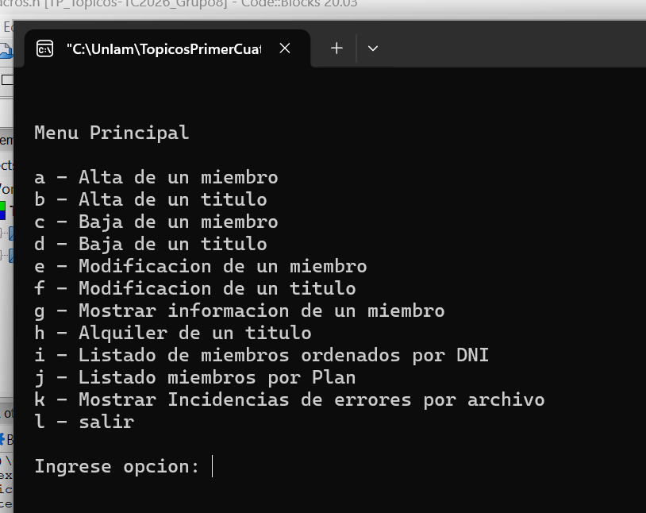

# 🎬 Videoclub Cinefilia – Sistema de gestión

¡Bienvenido/a al sistema del videoclub **Cinefilia**!

Cinefilia es un videoclub con títulos de películas bien exclusivos, y la idea es llevar todo ese catálogo (junto con los miembros del club) a una plataforma de streaming. Pero antes de pensar en el streaming, hay que tener la casa en orden: por eso este proyecto es el primer paso, y se encarga de **gestionar los títulos y los miembros del videoclub**.

Es un programa de consola escrito en **C**, hecho para el TP de Tópicos (2C 2025).

## 📸 Menú de gestión

Todo arranca desde el menú principal, desde donde se maneja el sistema:



## 🧩 ¿Qué hay en el proyecto?

| Archivo | Para qué sirve |
|---|---|
| `main.c` | Punto de entrada del programa |
| `menu.c` / `menu.h` | El menú de gestión |
| `archivos.c` / `archivos.h` | Manejo de archivos |
| `indice.c` / `indice.h` | Manejo de índices |
| `validaciones.c` / `validaciones.h` | Validaciones de los datos ingresados |
| `estructura.h` | Estructuras de datos del sistema |
| `miembros-VC.txt` | Datos de los miembros del videoclub |
| `TP-Tópicos-2C2025.pdf` | Enunciado del trabajo práctico |

## 🚀 Cómo correrlo

1. Cloná el repo:
   ```bash
   git clone https://github.com/RamiroJavierDeRogatis090/videoclub-system.git
   cd videoclub-system
   ```
2. Abrí el proyecto `TPtopicosUltimaVersion.cbp` con **Code::Blocks** y compilalo (o compilá los `.c` con `gcc` si preferís):
   ```bash
   gcc main.c menu.c archivos.c indice.c validaciones.c -o videoclub
   ./videoclub
   ```
3. ¡Listo! Navegá por el menú y empezá a gestionar.

## 👤 Autor

**Ramiro De Rogatis** – [@RamiroJavierDeRogatis090](https://github.com/RamiroJavierDeRogatis090)
